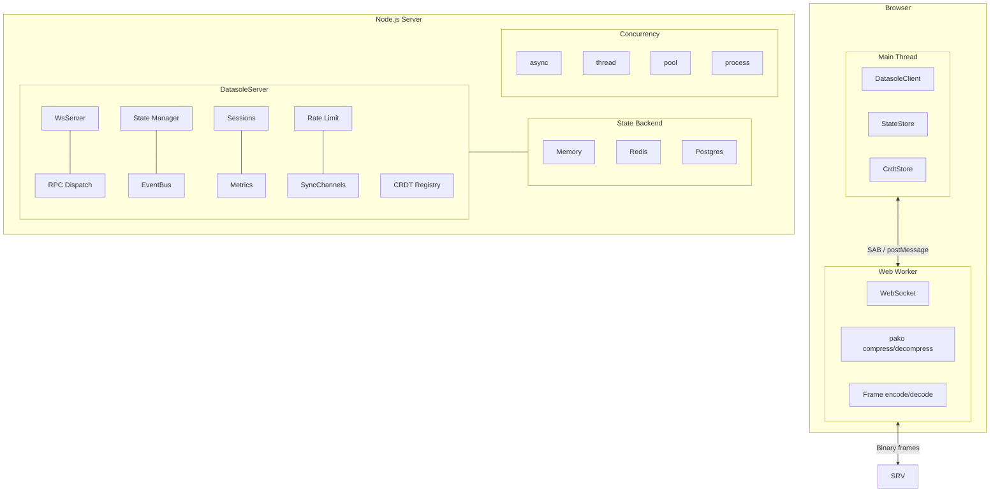

# datasole

[](https://github.com/mayanklahiri/datasole/actions/workflows/ci.yml)
[](https://www.npmjs.com/package/datasole)
[](https://opensource.org/licenses/Apache-2.0)
[](https://www.typescriptlang.org/)

**[Documentation](https://mayanklahiri.github.io/datasole/)** · **[Tutorials](https://mayanklahiri.github.io/datasole/tutorials)** · **[API Reference](https://mayanklahiri.github.io/datasole/client)**

> **Production-proven** — datasole powers realtime control-plane infrastructure at a Fortune 50 cloud provider.

## Why datasole?

You're building something realtime. You've evaluated the options. Socket.IO is text-only JSON with no state primitives. The managed services charge per message and own your infra. The CRDT libraries give you sync but no transport. The transport libraries give you WebSockets but no sync. Nothing gives you everything in one package without vendor lock-in.

**datasole is the missing full-stack realtime primitive for TypeScript.** One `npm install`. No platform signup. No codegen. You own the server, you pick the database, you deploy where you want.

```bash
npm install datasole
```

### What you get

- **Off-main-thread networking** — WebSocket runs in a Web Worker. Your UI thread never touches I/O.
- **Binary wire protocol** — Compressed binary frames, not JSON text. 60–80% smaller on the wire.
- **Automatic state sync** — Server mutates state, clients get diffs. No manual diffing, no full snapshots.
- **Built-in CRDTs** — Conflict-free bidirectional sync for collaborative features. No resolution code.
- **Typed RPC** — Multiplexed request/response over the same connection. Types flow end-to-end.
- **Four concurrency models** — Event loop, thread-per-connection, thread pool, or process isolation.
- **Pluggable everything** — State backends (memory, Redis, Postgres), rate limiters, metric exporters.
- **One package** — Client, server, shared types, Web Worker, `.d.ts` declarations. ESM, CJS, and IIFE.
- **Framework-agnostic** — React, Vue, Svelte, vanilla JS on the client. Express, NestJS, Fastify, `http.createServer()` on the server.
- **36 KB total** — Client + worker gzip. Includes compression, framing, diffing, CRDTs, and the worker transport.

## Quick start

**Server** — attach to any Node.js HTTP server:

```typescript
import { createServer } from 'http';
import { DatasoleServer } from 'datasole/server';

const ds = new DatasoleServer();
const http = createServer();
ds.attach(http);
http.listen(3000);
```

**Client** — connect from a browser:

```html
<script src="https://unpkg.com/datasole/dist/client/datasole.iife.min.js"></script>
<script>
  const ds = new Datasole.DatasoleClient({ url: 'ws://localhost:3000' });
  ds.connect();
</script>
```

## Patterns

datasole gives you seven composable patterns. Use one, or combine them on a single connection.

### RPC — client asks, server answers

```typescript
// server
ds.rpc('getUser', async ({ id }) => {
  return await db.users.findById(id);
});

// client
const user = await ds.call('getUser', { id: 42 });
```

### Server events — push to all clients

```typescript
// server
setInterval(() => {
  ds.broadcast('price', { AAPL: 187.42, GOOG: 141.8 });
}, 1000);

// client
ds.on('price', (data) => updateTicker(data));
```

### Live state — server owns it, clients mirror it

The most common pattern. The server mutates state, datasole diffs it, and all clients receive only what changed.

```typescript
// server
ds.rpc('addTodo', async ({ text }) => {
  todos.push({ id: Date.now(), text, done: false });
  await ds.setState('todos', todos);
  return { ok: true };
});
```

```tsx
// client (React) — no Redux, no Vuex, no manual sync
function TodoList() {
  const [todos, setTodos] = useState([]);
  useEffect(() => {
    ds.connect();
    ds.subscribeState('todos', setTodos);
    return () => ds.disconnect();
  }, []);
  return (
    <ul>
      {todos.map((t) => (
        <li key={t.id}>{t.text}</li>
      ))}
    </ul>
  );
}
```

### Client events — fire and forget

```typescript
// client
ds.emit('analytics', { action: 'click', target: 'buy-button' });

// server
ds.onClientEvent('analytics', (data, ctx) => {
  telemetry.track(ctx.connectionId, data);
});
```

### CRDTs — conflict-free bidirectional sync

```typescript
// server
ds.registerCrdt('votes', 'pn-counter');

// client A
ds.crdtIncrement('votes', 1);

// client B (simultaneously)
ds.crdtIncrement('votes', 1);

// both converge to votes: 2, no conflicts
```

### Sync channels — control when diffs flush

```typescript
ds.createSyncChannel({
  key: 'cursor-positions',
  flush: 'debounced',
  debounceMs: 50,
});

ds.createSyncChannel({
  key: 'trade-executions',
  flush: 'immediate',
});
```

### Combinations — all patterns on one connection

Tutorial 10 builds a collaborative task board using RPC (add/move tasks), live state (board sync), client events (chat), and CRDTs (vote counts) — all on a single WebSocket connection.

## Architecture



## Bundle sizes

The shared and server bundles externalize runtime dependencies (`pako`, `fast-json-patch`, `ws`). Client bundles inline everything for zero-dependency browser usage. Verified by CI on every push.

| Bundle                | Loaded by             |     Raw |        Gzip |
| --------------------- | --------------------- | ------: | ----------: |
| **Client IIFE** (min) | `<script>` tag        | 69.7 KB | **21.4 KB** |
| **Worker IIFE** (min) | Web Worker            | 47.6 KB | **15.0 KB** |
| **Shared** (ESM)      | `import` from bundler | 10.3 KB |      2.5 KB |
| **Server** (ESM)      | Node.js `import`      | 64.0 KB |     12.7 KB |

A browser downloads the client IIFE + worker for a total of **36 KB gzip** — that includes compression, binary framing, JSON Patch diffing, CRDTs, and the Web Worker transport.

## How datasole compares

| Capability                     |   datasole   |   Socket.IO    |      Ably      |     Pusher     | Liveblocks |    PartyKit     |
| ------------------------------ | :----------: | :------------: | :------------: | :------------: | :--------: | :-------------: |
| Self-hosted / open source      | ✓ Apache 2.0 |     ✓ MIT      |    Managed     |    Managed     |  Managed   |   Cloudflare    |
| Web Worker transport           |      ✓       |       —        |       —        |       —        |     —      |        —        |
| Binary frames + compression    |   ✓ always   |     Opt-in     |       ✓        |       —        |     —      |        —        |
| JSON Patch state sync          |      ✓       |       —        |       —        |       —        |     —      |        —        |
| Built-in CRDTs                 |      ✓       |       —        |       —        |       —        | ✓ LiveMap  |     Via Yjs     |
| Typed RPC (multiplexed)        |      ✓       |       —        |       —        |       —        |     —      |        —        |
| Server concurrency models      |      4       |   1 (async)    |      N/A       |      N/A       |    N/A     | Durable Objects |
| Frame-level rate limiting      |      ✓       |       —        |    Managed     |    Managed     |  Managed   |        —        |
| Sync channels (batch/debounce) |      ✓       |       —        |       —        |       —        |     —      |        —        |
| Session persistence            |      ✓       |       —        |       —        |       —        |     ✓      |   Via storage   |
| Strict TypeScript end-to-end   |      ✓       | Types included | Types included | Types included |     ✓      |        ✓        |

## Test coverage

203 unit tests + 38 e2e tests (Playwright, headless Chromium, desktop + mobile viewports). CI matrix on Node 22 LTS and Node 24. Quality gate (`npm run gate`) enforces format, lint, types, build, test, coverage, e2e, metrics, and docs on every push.

## Tutorial

The [tutorial](https://mayanklahiri.github.io/datasole/tutorials) builds from a bare connection to a production deployment in 10 steps:

| #   | Topic         | What you build                         |
| --- | ------------- | -------------------------------------- |
| 1   | Hello World   | Connect client to server               |
| 2   | RPC           | Typed request/response                 |
| 3   | Server Events | Live stock ticker broadcast            |
| 4   | Live State    | Server-synced dashboard (React/Vue)    |
| 5   | Chat + Auth   | Authenticated chat room                |
| 6   | CRDTs         | Conflict-free shared counter           |
| 7   | Sync Channels | Tunable flush strategies               |
| 8   | Sessions      | Reconnection-safe user state           |
| 9   | Production    | Thread pool, Redis, rate limiting, pm2 |
| 10  | Task Board    | All patterns combined                  |

## Documentation

| Document                                 | Contents                                        |
| ---------------------------------------- | ----------------------------------------------- |
| **[Tutorials](docs/tutorials.md)**       | Progressive 10-step guide with e2e screenshots  |
| **[Examples](docs/examples.md)**         | Copy-paste recipes organized by pattern         |
| **[Integrations](docs/integrations.md)** | React, Vue, Next.js, Express, NestJS, AdonisJS  |
| **[Comparison](docs/comparison.md)**     | Feature matrix vs Socket.IO, Ably, Pusher, etc. |
| [Client API](docs/client.md)             | All client methods and options                  |
| [Server API](docs/server.md)             | All server methods and options                  |
| [Architecture](docs/architecture.md)     | Wire protocol, diagrams, data flow              |
| [State Backends](docs/state-backends.md) | Memory, Redis, Postgres configuration           |
| [Metrics](docs/metrics.md)               | Prometheus and OpenTelemetry setup              |
| [Decisions](docs/decisions.md)           | Architecture Decision Records                   |
| [Contributing](docs/contributing.md)     | Dev setup, commands, PR guidelines              |

For AI coding agents, see [AGENTS.md](AGENTS.md) — it covers the quality gate, coding conventions, and ADR workflow.

## License

[Apache-2.0](LICENSE)
