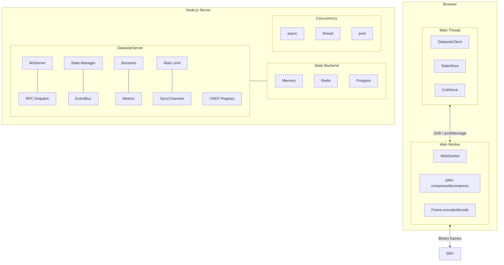
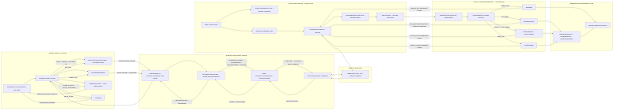

<p align="center">
  
</p>

<h1 align="center">datasole</h1>

<p align="center">
  <strong>The full-stack realtime primitive for TypeScript</strong>
</p>

<p align="center">
  <a href="https://github.com/mayanklahiri/datasole/actions/workflows/ci.yml"></a>
  <a href="https://www.npmjs.com/package/datasole"></a>
  <a href="https://opensource.org/licenses/Apache-2.0"></a>
  <a href="https://www.typescriptlang.org/"></a>
  <a href="https://mayanklahiri.github.io/datasole/quality"></a>
</p>

<p align="center">
  <strong><a href="https://mayanklahiri.github.io/datasole/">Documentation</a></strong> · <strong><a href="https://mayanklahiri.github.io/datasole/tutorials">Tutorials</a></strong> · <strong><a href="https://mayanklahiri.github.io/datasole/client">API Reference</a></strong>
</p>

## Why datasole?

You're building something realtime. You've evaluated the options:

- **Socket.IO** — text-only JSON, no state primitives, compression disabled by default due to memory leaks
- **Managed services** (Ably, Pusher) — per-message pricing, vendor lock-in, "contact sales" for scaling
- **CRDT libraries** (Yjs, Automerge) — sync but no transport
- **Transport libraries** — WebSockets but no sync, no state, no types

**Nothing gives you the full stack in a single TypeScript package.**

Anything interesting enough to build will probably need a _combination_ of these primitives — typed RPC, realtime events, state sync, CRDTs, auth, rate limiting, metrics. Especially now with agentic AI coding, where LLMs compose libraries on your behalf: the more deterministic and well-tested the building blocks, the less likely your agent stitches together an incompatible, untested, non-performant Frankenstein. datasole is the known set of Lego blocks — one package, deeply tested, designed to compose.

Instead of letting your agent non-deterministically re-integrate five separate libraries every time, datasole is a full-stack, scalable, performant, observable, and thoroughly tested framework. It lets you focus on the fun, creative parts of realtime applications without worrying about compatibility, performance, scalability, or raw WebSocket plumbing — plus all the "enterprise" pieces (auth, rate limiting, session persistence, metrics, structured logging) are built in.

One `npm install` — server, client, shared types, Web Worker, `.d.ts` declarations. No platform signup. No codegen. You own the server, you pick the database, you deploy where you want.

```bash
npm install datasole
```

### The big four

1. **Full-stack TypeScript, single package** — Server, client, shared types, Web Worker, and `.d.ts` declarations from one `npm install`. No codegen, no separate client/server packages, no polyglot friction. ESM, CJS, and IIFE bundles included.

2. **Guaranteed compression (not permessage-deflate)** — datasole compresses every binary frame >256 B using pako in user-space. No extension negotiation, no per-connection zlib state, no browser compatibility matrix. Socket.IO [disabled permessage-deflate by default](https://github.com/socketio/engine.io/commit/5ad273601eb66c7b318542f87026837bf9dddd21) due to memory leaks crashing production servers. datasole sidesteps the entire problem.

3. **Scale without "contact sales"** — Swap in Redis or Postgres endpoints and go from single-process to distributed with zero code changes. Three concurrency models (async, thread, thread-pool). pm2/k8s ready. Horizontal scaling is built in, not a pricing tier.

4. **Open source, Apache-2.0, free forever** — No per-message pricing. No vendor lock-in. No "enterprise tier for production use." Self-host on your infra, your terms.

### What you get

- **Off-main-thread networking** — WebSocket runs in a Web Worker. Your UI thread never touches I/O.
- **Binary wire protocol** — Compressed binary frames, not JSON text. 60–80% smaller on the wire.
- **Automatic state sync** — Server mutates state, clients get diffs. No manual diffing, no full snapshots.
- **Built-in CRDTs** — Conflict-free bidirectional sync for collaborative features. No resolution code.
- **Typed RPC** — Multiplexed request/response over the same connection. Types flow end-to-end.
- **Pluggable everything** — State backends (memory, Redis, Postgres), rate limiters, metric exporters.
- **Observability** — Prometheus and OpenTelemetry metric exporters built in.
- **Framework-agnostic** — React, Vue, Svelte, vanilla JS on the client. Express, NestJS, Fastify, `http.createServer()` on the server.
- **36 KB total** — Client + worker gzip. Includes compression, framing, diffing, CRDTs, and the worker transport.

### Use cases

datasole is a good fit anywhere you need performant, scalable realtime communication:

- Realtime multiplayer games and game lobbies
- Interactive internal tools and admin dashboards
- Live analytics and monitoring dashboards
- Wrapped native apps (Bun single-executable, Node SEA, Electron, Tauri) with rich web UIs
- Synchronized streaming (internet radio, watch parties, live commentary)
- Rich frontends for local-process application servers (dev tools, CLIs with a web UI)
- Collaborative editing and shared whiteboards
- IoT device control panels and telemetry viewers
- Trading and financial data feeds
- Live customer support and chat systems
- Auction and bidding platforms
- Live sports scoreboards and event tickers
- CI/CD pipeline status walls
- Classroom and webinar interactive Q&A

## Quick start

**Server** — attach to any Node.js HTTP server:

```typescript
import { createServer } from 'http';
import { DatasoleServer } from 'datasole/server';

const ds = new DatasoleServer();
const http = createServer();
ds.attach(http);
http.listen(3000);
```

**Client** — connect from a browser:

```html
<script src="https://unpkg.com/datasole/dist/client/datasole.iife.min.js"></script>
<script>
  const ds = new Datasole.DatasoleClient({ url: 'ws://localhost:3000' });
  ds.connect();
</script>
```

## Patterns

datasole gives you seven composable patterns. Use one, or combine them on a single connection.

### RPC — client asks, server answers

```typescript
// server
ds.rpc.register('getUser', async ({ id }) => {
  return await db.users.findById(id);
});

// client
const user = await ds.rpc('getUser', { id: 42 });
```

### Server events — push to all clients

```typescript
// server
setInterval(() => {
  ds.broadcast('price', { AAPL: 187.42, GOOG: 141.8 });
}, 1000);

// client
ds.on('price', ({ data }) => updateTicker(data));
```

### Live state — server owns it, clients mirror it

The most common pattern. The server mutates state, datasole diffs it, and all clients receive only what changed.

```typescript
// server
ds.rpc.register('addTodo', async ({ text }) => {
  todos.push({ id: Date.now(), text, done: false });
  await ds.setState('todos', todos);
  return { ok: true };
});
```

```tsx
// client (React) — no Redux, no Vuex, no manual sync
function TodoList() {
  const [todos, setTodos] = useState([]);
  useEffect(() => {
    ds.connect();
    ds.subscribeState('todos', setTodos);
    return () => ds.disconnect();
  }, []);
  return (
    <ul>
      {todos.map((t) => (
        <li key={t.id}>{t.text}</li>
      ))}
    </ul>
  );
}
```

### Client events — fire and forget

```typescript
// client
ds.emit('analytics', { action: 'click', target: 'buy-button' });

// server
ds.events.on('analytics', ({ data }) => {
  telemetry.track(data);
});
```

### CRDTs — conflict-free bidirectional sync

```typescript
// server
import { PNCounter } from 'datasole';
ds.registerCrdt('votes', new PNCounter('server'));

// client A
const store = ds.registerCrdt('clientA');
const counter = store.register('votes', 'pn-counter');
counter.increment(1);

// client B (simultaneously)
counter.increment(1);

// both converge to votes: 2, no conflicts
```

### Sync channels — control when diffs flush

```typescript
ds.createSyncChannel({
  key: 'cursor-positions',
  flush: 'debounced',
  debounceMs: 50,
});

ds.createSyncChannel({
  key: 'trade-executions',
  flush: 'immediate',
});
```

### Combinations — all patterns on one connection

Tutorial 10 builds a collaborative task board using RPC (add/move tasks), live state (board sync), client events (chat), and CRDTs (vote counts) — all on a single WebSocket connection.

## Architecture



## Bundle sizes

The shared and server bundles externalize runtime dependencies (`pako`, `fast-json-patch`, `ws`). Client bundles inline everything for zero-dependency browser usage. Verified by CI on every push.

| Bundle                | Loaded by             |     Raw |        Gzip |
| --------------------- | --------------------- | ------: | ----------: |
| **Client IIFE** (min) | `<script>` tag        | 72.0 KB | **22.2 KB** |
| **Worker IIFE** (min) | Web Worker            | 48.3 KB | **15.3 KB** |
| **Shared** (CJS)      | `import` from bundler | 15.3 KB |      4.0 KB |
| **Server** (CJS)      | Node.js `require`     | 72.1 KB |     16.1 KB |

A browser downloads the client IIFE + worker for a total of **~37.5 KB gzip** — that includes compression, binary framing, JSON Patch diffing, CRDTs, and the Web Worker transport.

## How datasole compares

| Capability                     |           datasole            |         Socket.IO          |            Ably            |           Pusher           |         Liveblocks         |        PartyKit        |
| ------------------------------ | :---------------------------: | :------------------------: | :------------------------: | :------------------------: | :------------------------: | :--------------------: |
| Self-hosted / open source      | :white_check_mark: Apache 2.0 |   :white_check_mark: MIT   |        :x: Managed         |        :x: Managed         |        :x: Managed         |  :warning: Cloudflare  |
| Full-stack single TS package   |      :white_check_mark:       |        :x: separate        |            :x:             |            :x:             |        :x: multiple        |      :x: multiple      |
| Web Worker transport           |      :white_check_mark:       |            :x:             |            :x:             |            :x:             |            :x:             |          :x:           |
| Binary frames + compression    |   :white_check_mark: always   |     :warning: opt-in¹      |     :white_check_mark:     |            :x:             |            :x:             |          :x:           |
| JSON Patch state sync          |      :white_check_mark:       |            :x:             |            :x:             |            :x:             |            :x:             |          :x:           |
| Built-in CRDTs                 |      :white_check_mark:       |            :x:             |            :x:             |            :x:             | :white_check_mark: LiveMap |   :warning: via Yjs    |
| Typed RPC (multiplexed)        |      :white_check_mark:       |            :x:             |            :x:             |            :x:             |            :x:             |          :x:           |
| Server concurrency models      |  :white_check_mark: 4 modes   |       :x: 1 (async)        |            N/A             |            N/A             |            N/A             |    Durable Objects     |
| Pluggable backends (Redis/PG)  |      :white_check_mark:       |   :warning: via adapter    |        :x: managed         |        :x: managed         |        :x: managed         | :warning: storage API  |
| Frame-level rate limiting      |      :white_check_mark:       |            :x:             | :white_check_mark: managed | :white_check_mark: managed | :white_check_mark: managed |          :x:           |
| Sync channels (batch/debounce) |      :white_check_mark:       |            :x:             |            :x:             |            :x:             |            :x:             |          :x:           |
| Session persistence            |      :white_check_mark:       |            :x:             |            :x:             |            :x:             |     :white_check_mark:     |   :warning: storage    |
| Prometheus / OTel metrics      |      :white_check_mark:       |            :x:             |       :x: dashboard        |       :x: dashboard        |       :x: dashboard        |          :x:           |
| HTTP polling fallback          |              :x:              |     :white_check_mark:     |     :white_check_mark:     |     :white_check_mark:     |     :white_check_mark:     |          :x:           |
| Rooms / namespaces             |              :x:              |     :white_check_mark:     |     :white_check_mark:     |     :white_check_mark:     |     :white_check_mark:     |   :white_check_mark:   |
| Native mobile SDKs             |              :x:              |     :white_check_mark:     |     :white_check_mark:     |     :white_check_mark:     |            :x:             |          :x:           |
| Rich-text CRDT                 |              :x:              |            :x:             |            :x:             |            :x:             |   :white_check_mark: Yjs   | :white_check_mark: Yjs |
| Global edge network            |              :x:              |            :x:             |     :white_check_mark:     |     :white_check_mark:     |     :white_check_mark:     |   :white_check_mark:   |
| Community size                 |           :x: small           | :white_check_mark: massive |  :white_check_mark: large  |  :white_check_mark: large  |     :warning: growing      |   :warning: growing    |
| Free forever (self-hosted)     |      :white_check_mark:       |     :white_check_mark:     |        :x: per-msg         |        :x: per-msg         |        :x: per-room        |     :x: CF pricing     |

> ¹ Socket.IO [disabled permessage-deflate by default](https://github.com/socketio/engine.io/commit/5ad273601eb66c7b318542f87026837bf9dddd21) due to memory leaks and crashes in production. datasole uses user-space pako compression on every frame >256 B — no negotiation, no per-connection zlib state, no browser compat issues.

## Performance (end-to-end, headless Chromium)

The exhaustive CI/nightly gate measures end-to-end performance — a real browser client connected to a real Node.js server via binary WebSocket, 3 seconds of sustained load per scenario:

| Scenario                  |   Ops/sec |     P50 |    P95 |
| ------------------------- | --------: | ------: | -----: |
| RPC echo (sequential)     |       ~33 |  0.44ms | 1.48ms |
| RPC echo (10x concurrent) |       ~37 |  0.42ms |      — |
| Server event receive      |  ~913/sec |       — |      — |
| Live state sync           |  ~192/sec |       — |      — |
| Client event emit         | ~255K/sec | <0.01ms | 0.01ms |
| CRDT increment            | ~1.3K/sec |  0.73ms | 1.35ms |
| Mixed workload            |       ~50 |  0.34ms | 0.68ms |

Numbers vary by machine. Live data: [Performance Benchmarks](https://mayanklahiri.github.io/datasole/performance).

## Test coverage

485 unit tests plus core and demo Playwright coverage across desktop/mobile viewports. `npm run gate` is the non-performance developer gate; `npm run gate:full` is the exhaustive CI/nightly gate that adds benchmarks, metrics, docs, and bot-authored `[skip ci]` artifact refresh commits on `main`.

## Architecture Diagram



Raw diagram source: [`docs/architecture-overview.mmd`](docs/architecture-overview.mmd).

## Tutorial

The [tutorial](https://mayanklahiri.github.io/datasole/tutorials) builds from a bare connection to a production deployment in 10 steps:

| #   | Topic         | What you build                         |
| --- | ------------- | -------------------------------------- |
| 1   | Hello World   | Connect client to server               |
| 2   | RPC           | Typed request/response                 |
| 3   | Server Events | Live stock ticker broadcast            |
| 4   | Live State    | Server-synced dashboard (React/Vue)    |
| 5   | Chat + Auth   | Authenticated chat room                |
| 6   | CRDTs         | Conflict-free shared counter           |
| 7   | Sync Channels | Tunable flush strategies               |
| 8   | Sessions      | Reconnection-safe user state           |
| 9   | Production    | Thread pool, Redis, rate limiting, pm2 |
| 10  | Task Board    | All patterns combined                  |

## Documentation

| Document                                       | Contents                                             |
| ---------------------------------------------- | ---------------------------------------------------- |
| **[Developer Guide](docs/developer-guide.md)** | Contract-first setup with server/client integrations |
| **[Tutorials](docs/tutorials.md)**             | Progressive 10-step guide with e2e screenshots       |
| **[Demos](docs/demos.md)**                     | Vanilla, React+Express, Vue+NestJS full apps         |
| **[Configuration](docs/configuration.md)**     | Consolidated server/client options reference         |
| **[Comparison](docs/comparison.md)**           | Feature matrix vs Socket.IO, Ably, Pusher, etc.      |
| [Client API](docs/client.md)                   | All client methods and options                       |
| [Server API](docs/server.md)                   | All server methods and options                       |
| [Architecture](docs/architecture.md)           | Wire protocol, diagrams, data flow                   |
| [State Backends](docs/state-backends.md)       | Memory, Redis, Postgres configuration                |
| [Metrics](docs/metrics.md)                     | Prometheus and OpenTelemetry setup                   |
| [Decisions](docs/decisions.md)                 | Architecture Decision Records                        |
| [Contributing](docs/contributing.md)           | Dev setup, commands, PR guidelines                   |

For AI coding agents, see [AGENTS.md](AGENTS.md) — it covers the quality gate, coding conventions, and ADR workflow.

## License

[Apache-2.0](LICENSE)
