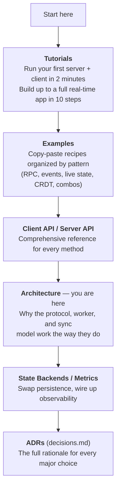
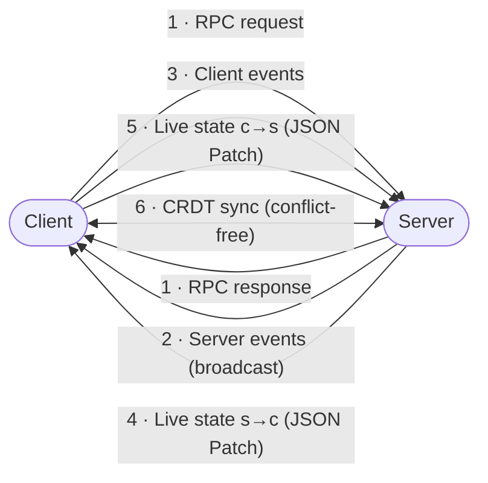
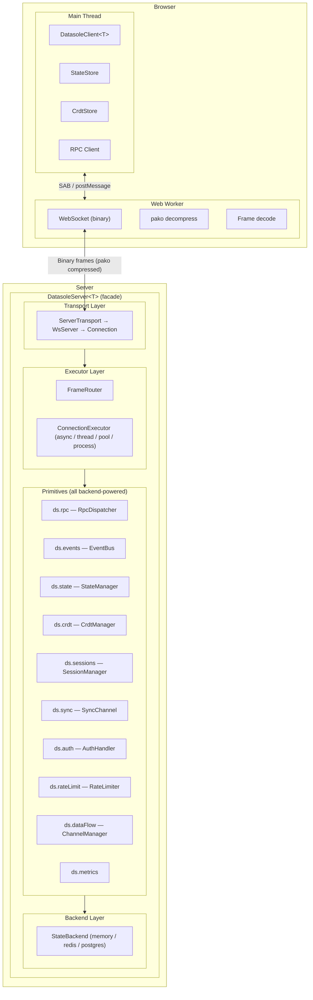
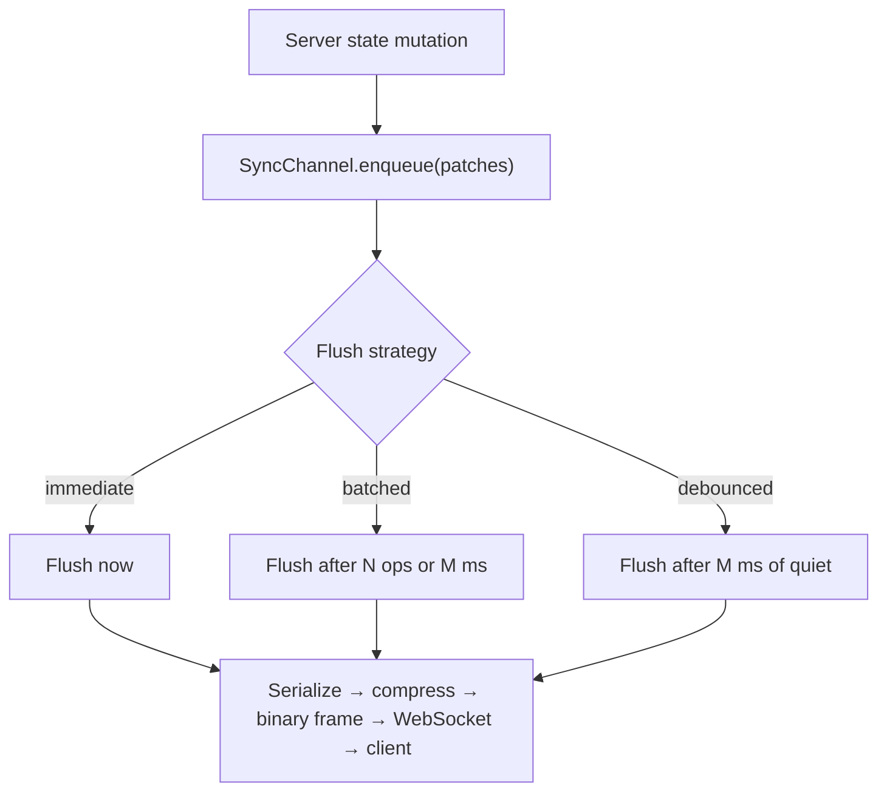
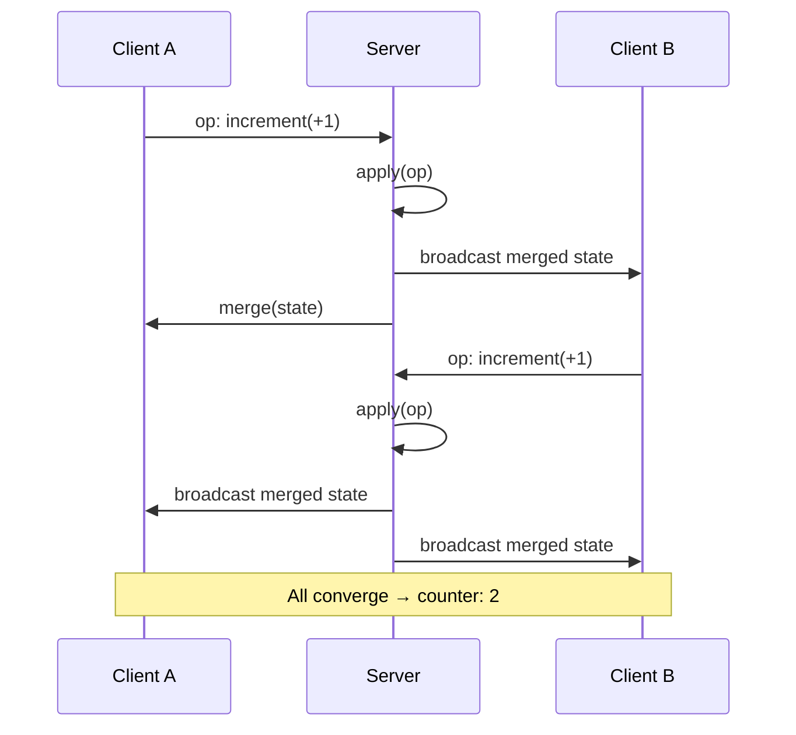

# Architecture

> **New to datasole?** Start with the [Tutorials](tutorials.md) — they'll get you from zero to a running app faster than reading architecture docs. Come back here when you're curious about _why_ things work the way they do.

## Learning Path



## Overview

Datasole is a full-stack TypeScript framework for realtime applications. It provides synchronized server-to-client data structures, bidirectional events, concurrent RPC, and CRDT-based bidirectional sync — all over a single binary WebSocket connection.

## Data Flow Patterns

Datasole supports seven composable patterns. Use one, or combine them freely on a single connection:



The most common pattern for real-world apps is **client → server RPC + server → client live state**: the client sends actions, the server processes them and updates its model, and all clients see a live mirror. See [Tutorial 4](tutorials.md#4-live-state--a-server-synced-dashboard) and [Tutorial 10](tutorials.md#10-putting-it-all-together--a-collaborative-task-board).

## System Diagram



### Directory Structure (server)

```
src/server/
├── backends/        # StateBackend implementations + factory
│   ├── memory.ts    # MemoryBackend (default)
│   ├── redis.ts     # RedisBackend (optional peer dep)
│   ├── postgres.ts  # PostgresBackend (optional peer dep)
│   ├── factory.ts   # createBackend(config)
│   └── types.ts     # StateBackend interface
├── executor/        # ConnectionExecutor implementations + FrameRouter
│   ├── async-executor.ts
│   ├── thread-executor.ts
│   ├── pool-executor.ts
│   ├── process-executor.ts
│   ├── frame-router.ts
│   ├── factory.ts   # createExecutor(config)
│   └── types.ts     # ConnectionExecutor interface
├── primitives/      # All backend-powered services
│   ├── rpc/         # RpcDispatcher
│   ├── events/      # EventBus
│   ├── state/       # StateManager, SessionManager
│   ├── crdt/        # CrdtManager
│   ├── sync/        # SyncChannel
│   ├── auth/        # AuthHandler
│   ├── rate-limit/  # BackendLimiter
│   └── data-flow/   # ChannelManager
├── transport/       # ServerTransport + WsServer + Connection
├── server.ts        # DatasoleServer<T> facade
└── types.ts
```

## Wire Protocol

All communication uses binary frames with the following envelope:

| Byte Offset | Size | Field                                         |
| ----------- | ---- | --------------------------------------------- |
| 0           | 1    | Opcode (see `src/shared/protocol/opcodes.ts`) |
| 1           | 4    | Correlation ID (uint32, big-endian)           |
| 5           | 4    | Payload length (uint32, big-endian)           |
| 9           | N    | Payload (pako-compressed if above threshold)  |

Opcodes cover: RPC request/response, event, state snapshot, state patch, CRDT operation, CRDT state, ping/pong, error.

## Connection Lifecycle

1. Client creates `DatasoleClient<T>` and calls `connect()`
2. Web Worker opens WebSocket to `wss://server/__ds`
3. ServerTransport receives HTTP upgrade → `AuthHandler` validates credentials
4. On success: `ConnectionContext` created with auth identity, metadata
5. FrameRouter assigns connection to a ConnectionExecutor (async / thread / pool / process)
6. Primitives push initial state snapshots via StateBackend
7. Ongoing: incremental JSON Patches, events, RPC, CRDT ops — all multiplexed
8. On disconnect: SessionManager flushes to StateBackend for future restore

## Sync Channel Architecture

Sync channels decouple _what_ is synchronized from _when_ it's flushed:



## CRDT Merge Flow



All three nodes converge to the same value regardless of operation order.

## Further Reading

| Topic                      | Where                               |
| -------------------------- | ----------------------------------- |
| Step-by-step learning      | [Tutorials](tutorials.md)           |
| Copy-paste recipes         | [Examples](examples.md)             |
| Client methods             | [Client API](client.md)             |
| Server methods             | [Server API](server.md)             |
| Persistence options        | [State Backends](state-backends.md) |
| Observability              | [Metrics](metrics.md)               |
| Why each decision was made | [ADRs](decisions.md)                |
