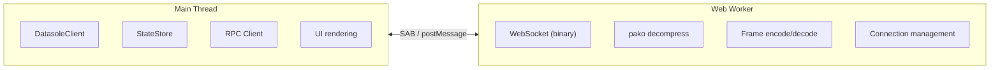

# Client API

> **New here?** Start with the [Developer Guide](developer-guide.md) for integration-first setup, then use [Tutorials](tutorials.md) for the full step-by-step build.

## DatasoleClient

The main client class. Framework-agnostic — works with React, Vue 3, Svelte, React Native, or vanilla JS.

### Constructor

```typescript
const client = new DatasoleClient({
  url: 'wss://example.com', // Server URL (ws:// or wss://)
  path: '/__ds', // WebSocket path (default: /__ds)
  auth: {
    token: 'jwt-token', // Sent as ?token= query parameter on the WebSocket URL
  },
  useWorker: true, // Run WebSocket in Web Worker (default: true)
  workerUrl: '/datasole-worker.iife.min.js', // Worker script URL (default: /datasole-worker.iife.min.js)
  useSharedArrayBuffer: false, // Zero-copy via SAB when available (default: false)
  reconnect: true, // Auto-reconnect on disconnect (default: true)
  reconnectInterval: 1000, // Base delay in ms between attempts (default: 1000)
  maxReconnectAttempts: 10, // Give up after N attempts (default: 10)
});
```

> **Note:** Only `auth.token` is supported. It is sent as a query parameter (`?token=…`) because the browser WebSocket API does not allow custom headers during the upgrade handshake.

### Connection

```typescript
client.connect(); // Establish WebSocket connection
client.disconnect(); // Close connection
const state = client.getConnectionState(); // 'disconnected' | 'connecting' | 'connected' | 'reconnecting'
```

### RPC — Call the Server

```typescript
// Typed request and response
const user = await client.rpc<{ name: string }>('getUser', { userId: '123' });
console.log(user.name);

// With timeout
const result = await client.rpc('slowQuery', { q: 'test' }, { timeout: 10000 });

// Multiple calls in flight simultaneously — they're multiplexed over one WebSocket
const [a, b, c] = await Promise.all([
  client.rpc('getUser', { id: '1' }),
  client.rpc('getUser', { id: '2' }),
  client.rpc('getUser', { id: '3' }),
]);
```

> **Tutorial:** [RPC — Call the Server, Get a Response](tutorials.md#2-rpc--call-the-server-get-a-response)

### Events — Send and Receive

```typescript
// Subscribe to server-pushed events
client.on<{ symbol: string; price: number }>('price', ({ data }) => {
  console.log(`${data.symbol}: $${data.price}`);
});

// Unsubscribe
client.off('price', handler);

// Send event to server
client.emit('chat:message', { text: 'hello' });
```

> **Tutorial:** [Server Events — A Live Stock Ticker](tutorials.md#3-server-events--a-live-stock-ticker)

### Live State — Server-Synced Data

```typescript
// Subscribe to a state key — callback fires on every JSON Patch update
client.subscribeState<Dashboard>('dashboard', (state) => {
  // state is the full, patched object — ready to render
  console.log(state.visitors, state.activeNow);
});

// Get current snapshot (synchronous)
const current = client.getState<Dashboard>('dashboard');
```

> **Tutorial:** [Live State — A Server-Synced Dashboard](tutorials.md#4-live-state--a-server-synced-dashboard) — the most important pattern for most apps

### CRDTs — Bidirectional Sync

```typescript
import { CrdtStore } from 'datasole/client';
import { PNCounter, LWWMap } from 'datasole';

const store = new CrdtStore('unique-client-id');

// Register CRDT instances
const counter = store.register('votes', 'pn-counter');
const doc = store.register<string>('document', 'lww-map');

// Local mutation → immediate local update
const op = counter.increment();

// Send op to server
client.emit('crdt:op', op);

// Apply remote state
client.on('crdt:state', ({ data }) => {
  store.mergeRemoteState('votes', data);
  console.log('Counter:', counter.value());
});
```

> **Tutorial:** [Bidirectional CRDT — A Shared Counter](tutorials.md#6-bidirectional-crdt--a-shared-counter)

## Full Method Reference

| Method                              | Description                                                       |
| ----------------------------------- | ----------------------------------------------------------------- |
| `connect()`                         | Establish WebSocket connection                                    |
| `disconnect()`                      | Close connection                                                  |
| `rpc<T>(method, params?, options?)` | Call server RPC method with typed response                        |
| `on<T>(event, handler)`             | Subscribe to server-pushed events                                 |
| `off<T>(event, handler)`            | Unsubscribe                                                       |
| `emit(event, data?)`                | Send event to server                                              |
| `subscribeState<T>(key, handler)`   | Subscribe to state changes (JSON Patch applied)                   |
| `getState<T>(key)`                  | Get current state snapshot                                        |
| `getConnectionState()`              | `'disconnected' \| 'connecting' \| 'connected' \| 'reconnecting'` |
| `registerCrdt(nodeId)`              | Register a `CrdtStore` for this client (returns `CrdtStore`)      |
| `getCrdtStore()`                    | Get the registered `CrdtStore` (or `null`)                        |

## Framework Integration

### React

```typescript
import { DatasoleClient } from 'datasole/client';
import { useEffect, useRef, useState } from 'react';

function useDatasole(url: string) {
  const clientRef = useRef(new DatasoleClient({ url }));
  useEffect(() => {
    clientRef.current.connect();
    return () => { clientRef.current.disconnect(); };
  }, [url]);
  return clientRef.current;
}

function useLiveState<T>(client: DatasoleClient, key: string): T | null {
  const [state, setState] = useState<T | null>(null);
  useEffect(() => {
    const sub = client.subscribeState<T>(key, setState);
    return () => sub.unsubscribe();
  }, [client, key]);
  return state;
}

// Usage:
function Dashboard() {
  const ds = useDatasole('wss://example.com');
  const dashboard = useLiveState<{ visitors: number }>(ds, 'dashboard');
  if (!dashboard) return <p>Loading...</p>;
  return <p>Visitors: {dashboard.visitors}</p>;
}
```

### Vue 3 SFC

```vue
<script setup lang="ts">
import { DatasoleClient } from 'datasole/client';
import { onMounted, onUnmounted, ref } from 'vue';

const client = new DatasoleClient({ url: 'wss://example.com' });
const dashboard = ref<Record<string, unknown>>({});
let stateSub: { unsubscribe(): void } | null = null;

onMounted(() => {
  client.connect();
  stateSub = client.subscribeState('dashboard', (s) => {
    dashboard.value = s;
  });
});

onUnmounted(() => {
  stateSub?.unsubscribe();
  client.disconnect();
});
</script>

<template>
  <p>Visitors: {{ dashboard.visitors }}</p>
</template>
```

### Vue 3 Composable

```typescript
import { DatasoleClient } from 'datasole/client';
import { onMounted, onUnmounted, ref, type Ref } from 'vue';

export function useDatasole(url: string) {
  const client = new DatasoleClient({ url });
  onMounted(() => client.connect());
  onUnmounted(() => client.disconnect());
  return client;
}

export function useLiveState<T>(client: DatasoleClient, key: string): Ref<T | null> {
  const state = ref<T | null>(null) as Ref<T | null>;
  let sub: { unsubscribe(): void } | null = null;
  onMounted(() => {
    sub = client.subscribeState<T>(key, (s) => {
      state.value = s;
    });
  });
  onUnmounted(() => sub?.unsubscribe());
  return state;
}
```

### React Native

Uses the fallback transport (no Web Workers). Set `useWorker: false`:

```typescript
import { DatasoleClient } from 'datasole/client';

const client = new DatasoleClient({
  url: 'wss://example.com',
  useWorker: false,
});
client.connect();
```

### Vanilla JS (Script Tag)

```html
<script src="https://unpkg.com/datasole/dist/client/datasole.iife.min.js"></script>
<script>
  const ds = new Datasole.DatasoleClient({ url: 'wss://example.com' });
  ds.connect();
  ds.subscribeState('dashboard', (state) => {
    document.getElementById('output').textContent = JSON.stringify(state);
  });
</script>
```

## Worker Architecture

When `useWorker: true` (the default), the WebSocket connection runs in a [Web Worker](https://developer.mozilla.org/en-US/docs/Web/API/Web_Workers_API), keeping the main thread free for rendering. The worker script is loaded from `workerUrl` (default: `/datasole-worker.iife.min.js`). The server must serve this file — see the [Demos](demos.md) for framework-specific examples.

Set `useWorker: false` for environments without Web Workers (React Native, SSR, Node.js).



- **SharedArrayBuffer (SAB):** Zero-copy ring buffer when `Cross-Origin-Opener-Policy` and `Cross-Origin-Embedder-Policy` headers are set.
- **postMessage with Transferable:** Fallback when SAB is unavailable. ArrayBuffers are transferred (not copied).
- **No worker:** Set `useWorker: false` for environments without Workers (React Native, SSR, Node.js test runners).
