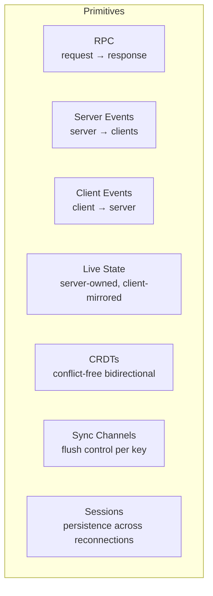

# Composability

datasole's core design principle is **composability**: every pattern works independently, and any combination of patterns shares a single WebSocket connection without configuration overhead.

## The seven primitives



Each primitive is independent — you can use RPC without ever touching CRDTs, or use live state without events. But the real power comes from combining them.

## How composition works

All primitives multiplex over the same binary WebSocket connection via opcodes in the 9-byte frame header. There's no "mode" to set, no channel subscription to manage. You just call the API:

```typescript
// Server — all on the same DatasoleServer instance
ds.rpc('addTask', handler); // RPC
ds.broadcast('notification', data); // Server event
ds.onClientEvent('typing', handler); // Client event
await ds.setState('board', board); // Live state
ds.registerCrdt('votes', 'pn-counter'); // CRDT
ds.createSyncChannel({ key: 'cursors', flush: 'debounced', debounceMs: 50 }); // Sync channel
```

```typescript
// Client — all on the same DatasoleClient instance
await ds.call('addTask', { text: 'Ship it' }); // RPC
ds.on('notification', show); // Server event
ds.emit('typing', { user: 'alice' }); // Client event
ds.subscribeState('board', setBoard); // Live state
ds.crdtIncrement('votes', 1); // CRDT
```

No separate connections. No routing config. No pub/sub channels to manage.

## Composition patterns

### Dashboard with actions (most common)

**Patterns**: RPC + Live State

The server owns a state tree. The client subscribes to diffs. When the user acts, the client calls an RPC, the server mutates state, and all clients see the update via JSON Patch.

```typescript
// Server
ds.rpc('toggleDone', async ({ id }) => {
  const todo = todos.find((t) => t.id === id);
  if (todo) todo.done = !todo.done;
  await ds.setState('todos', todos);
});

// Client
ds.subscribeState('todos', render);
button.onclick = () => ds.call('toggleDone', { id: 42 });
```

### Chat room with presence

**Patterns**: Client Events + Server Events + Sessions

Clients fire chat messages as events. The server broadcasts them to everyone. Session persistence means reconnected users get their nickname back.

```typescript
// Server
ds.onClientEvent('chat', (msg, ctx) => {
  ds.broadcast('chat', { user: ctx.userId, text: msg.text });
});

// Client
ds.emit('chat', { text: 'hello' });
ds.on('chat', (msg) => appendMessage(msg));
```

### Collaborative editing with voting

**Patterns**: CRDTs + Live State + RPC

Shared counters for voting (CRDT convergence), a server-owned task board (live state), and RPCs for structured mutations.

```typescript
// Server
ds.registerCrdt('votes:task-1', 'pn-counter');
ds.rpc('moveTask', async ({ id, column }) => {
  board[id].column = column;
  await ds.setState('board', board);
});

// Client A
ds.crdtIncrement('votes:task-1', 1); // vote

// Client B (simultaneously)
ds.crdtIncrement('votes:task-1', 1); // also votes
// Both converge to 2 — no conflicts
```

### Real-time analytics pipeline

**Patterns**: Client Events + Sync Channels + Live State

Clients stream analytics events. The server aggregates them into a dashboard state with debounced flushing (don't send 1000 patches/second — batch them).

```typescript
// Server
ds.createSyncChannel({ key: 'analytics', flush: 'batched', batchSize: 50, maxWaitMs: 1000 });
ds.onClientEvent('pageview', (data) => {
  stats.pageviews++;
  ds.setState('analytics', stats); // routed through sync channel
});

// Client
ds.emit('pageview', { path: '/pricing' });
ds.subscribeState('analytics', updateDashboard);
```

## Why this matters

Most realtime frameworks force you to pick a paradigm:

| Framework  | Primary paradigm     | Adding other patterns                         |
| ---------- | -------------------- | --------------------------------------------- |
| Socket.IO  | Events only          | Manual: build your own RPC, state sync, CRDTs |
| Liveblocks | CRDT collaboration   | Limited: events and storage, no RPC           |
| PartyKit   | Durable Object state | Manual: build your own RPC and events         |
| Ably       | Pub/sub channels     | Manual: no state sync, no CRDTs, no RPC       |

datasole gives you all seven primitives as first-class APIs on a single connection. You don't "add" RPC to an event system or bolt CRDTs onto a pub/sub channel. They're all there from the start, sharing the same binary transport, the same auth, the same rate limiting, and the same session persistence.

## The composability guarantee

Any combination of the seven primitives works on the same `DatasoleServer` + `DatasoleClient` pair. There are no conflicts, no ordering constraints, and no performance penalties for using multiple patterns simultaneously. The binary frame envelope handles multiplexing at the protocol level — each opcode identifies which subsystem handles the frame.
