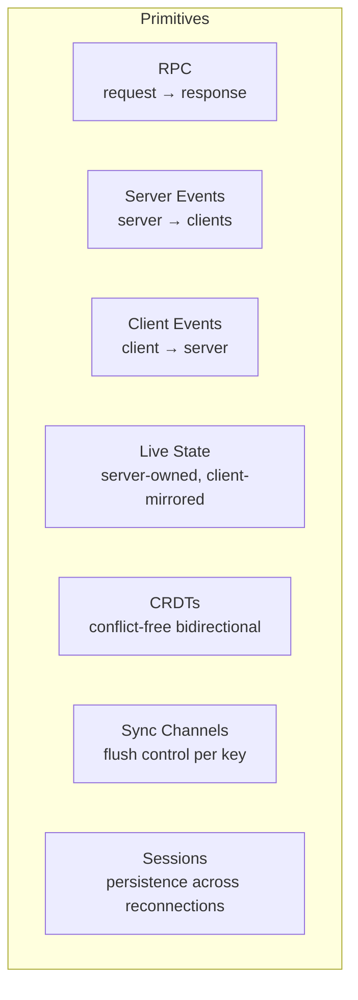

# Composability

datasole's core design principle is **composability**: every pattern works independently, and any combination of patterns shares a single WebSocket connection without configuration overhead.

Define one **`AppContract`** plus **`RpcMethod`**, **`Event`**, and **`StateKey`** enums (see [Developer Guide](developer-guide.md) and [Demos](demos.md)) so every call site stays nominal — the snippets below assume those imports.

## The seven primitives



Each primitive is independent — you can use RPC without ever touching CRDTs, or use live state without events. But the real power comes from combining them.

## How composition works

All primitives multiplex over the same binary WebSocket connection via opcodes in the 9-byte frame header. There's no "mode" to set, no channel subscription to manage. You just call the API:

```typescript
import { PNCounter } from 'datasole';
import { Event, RpcMethod, StateKey, SyncChannelKey } from './shared/contract';

// Server — all on the same DatasoleServer<AppContract> instance
ds.rpc.register(RpcMethod.AddTask, handler);
ds.localServer.broadcast(Event.Notification, data);
ds.primitives.events.on(Event.Typing, handler);
await ds.localServer.setState(StateKey.Board, board);
ds.primitives.crdt.registerByType('votes', new PNCounter('server'));
ds.localServer.createSyncChannel({
  key: SyncChannelKey.Cursors,
  direction: 'server-to-client',
  mode: 'json-patch',
  flush: { flushStrategy: 'debounced', debounceMs: 50 },
});
```

```typescript
import { Event, RpcMethod, StateKey } from './shared/contract';

// Client — all on the same DatasoleClient<AppContract> instance
await ds.rpc(RpcMethod.AddTask, { text: 'Ship it' });
ds.on(Event.Notification, ({ data }) => show(data));
ds.emit(Event.Typing, { user: 'alice' });
ds.subscribeState(StateKey.Board, setBoard);
const store = ds.registerCrdt('node1');
const counter = store.register('votes', 'pn-counter');
counter.increment(1);
```

No separate connections. No routing config. No pub/sub channels to manage.

## Composition patterns

### Dashboard with actions (most common)

**Patterns**: RPC + Live State

The server owns a state tree. The client subscribes to diffs. When the user acts, the client calls an RPC, the server mutates state, and all clients see the update via JSON Patch.

```typescript
// Server
import { RpcMethod, StateKey } from './shared/contract';

ds.rpc.register(RpcMethod.ToggleDone, async ({ id }) => {
  const todo = todos.find((t) => t.id === id);
  if (todo) todo.done = !todo.done;
  await ds.localServer.setState(StateKey.Todos, todos);
});
```

```typescript
// Browser
import { RpcMethod, StateKey } from './shared/contract';

client.subscribeState(StateKey.Todos, render);
button.onclick = () => void client.rpc(RpcMethod.ToggleDone, { id: 42 });
```

### Chat room with presence

**Patterns**: Client Events + Server Events + Sessions

Clients fire chat messages as events. The server broadcasts them to everyone. Session persistence means reconnected users get their nickname back.

```typescript
import { Event } from './shared/contract';

// Server
ds.primitives.events.on(Event.ChatSend, ({ data }) => {
  ds.localServer.broadcast(Event.ChatMessage, { user: data.user, text: data.text });
});
```

```typescript
// Browser
import { Event } from './shared/contract';

client.emit(Event.ChatSend, { text: 'hello', username: 'alice' });
client.on(Event.ChatMessage, ({ data }) => appendMessage(data));
```

### Collaborative editing with voting

**Patterns**: CRDTs + Live State + RPC

Shared counters for voting (CRDT convergence), a server-owned task board (live state), and RPCs for structured mutations.

```typescript
import { PNCounter } from 'datasole';
import { RpcMethod, StateKey } from './shared/contract';

ds.primitives.crdt.registerByType('votes:task-1', new PNCounter('server'));
ds.rpc.register(RpcMethod.MoveTask, async ({ id, column }) => {
  board[id].column = column;
  await ds.localServer.setState(StateKey.Board, board);
});

const storeA = client.registerCrdt('clientA');
const votesA = storeA.register('votes:task-1', 'pn-counter');
votesA.increment(1);

const storeB = client.registerCrdt('clientB');
const votesB = storeB.register('votes:task-1', 'pn-counter');
votesB.increment(1);
```

### Real-time analytics pipeline

**Patterns**: Client Events + Sync Channels + Live State

Clients stream analytics events. The server aggregates them into a dashboard state with debounced flushing (don't send 1000 patches/second — batch them).

```typescript
// Server
import { Event, StateKey, SyncChannelKey } from './shared/contract';

ds.localServer.createSyncChannel({
  key: SyncChannelKey.Analytics,
  direction: 'server-to-client',
  mode: 'json-patch',
  flush: { flushStrategy: 'batched', batchIntervalMs: 1000, maxBatchSize: 50 },
});
ds.primitives.events.on(Event.PageView, async () => {
  stats.pageviews++;
  await ds.localServer.setState(StateKey.Analytics, stats);
});
```

```typescript
// Browser
import { Event, StateKey } from './shared/contract';

client.emit(Event.PageView, { path: '/pricing' });
client.subscribeState(StateKey.Analytics, updateDashboard);
```

## Why this matters

Most realtime frameworks force you to pick a paradigm:

| Framework  | Primary paradigm     | Adding other patterns                         |
| ---------- | -------------------- | --------------------------------------------- |
| Socket.IO  | Events only          | Manual: build your own RPC, state sync, CRDTs |
| Liveblocks | CRDT collaboration   | Limited: events and storage, no RPC           |
| PartyKit   | Durable Object state | Manual: build your own RPC and events         |
| Ably       | Pub/sub channels     | Manual: no state sync, no CRDTs, no RPC       |

datasole gives you all seven primitives as first-class APIs on a single connection. You don't "add" RPC to an event system or bolt CRDTs onto a pub/sub channel. They're all there from the start, sharing the same binary transport, the same auth, the same rate limiting, and the same session persistence.

## The composability guarantee

Any combination of the seven primitives works on the same `DatasoleServer<AppContract>` + `DatasoleClient<AppContract>` pair. There are no conflicts, no ordering constraints, and no performance penalties for using multiple patterns simultaneously. The binary frame envelope handles multiplexing at the protocol level — each opcode identifies which subsystem handles the frame.
