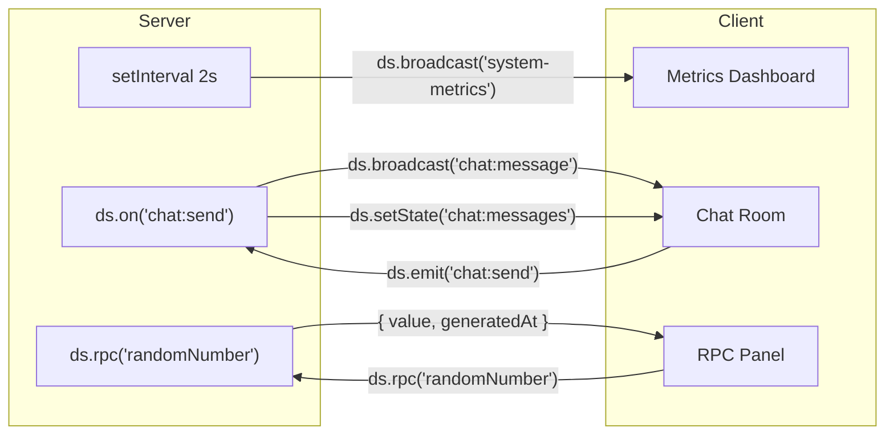
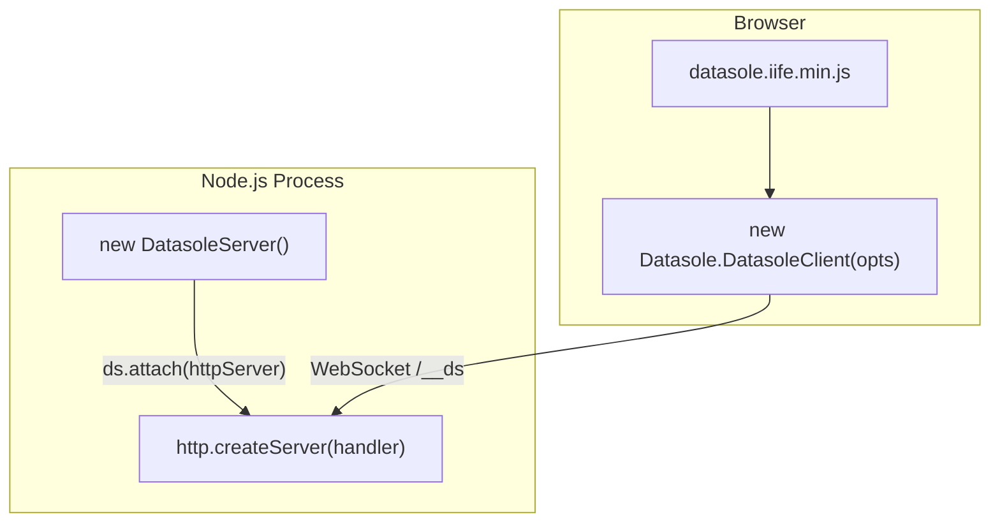
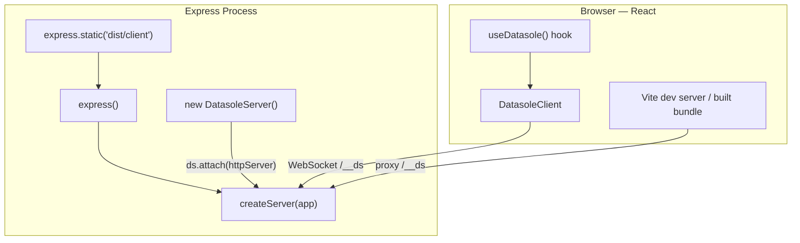
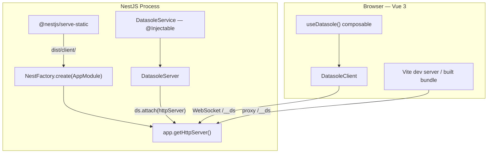

# Demos

Three independent demo applications ship with datasole, each implementing the **same realtime webapp** with a different framework stack. All demos are in the `demos/` directory and are tested by the automated e2e suite.

| Demo                              | Client                  | Server                      | Port |
| --------------------------------- | ----------------------- | --------------------------- | ---- |
| [Vanilla JS](#vanilla-js)         | Plain DOM + IIFE bundle | Node.js `http.createServer` | 4000 |
| [React + Express](#react-express) | React 19 + Vite         | Express 5                   | 4001 |
| [Vue 3 + NestJS](#vue-3-nestjs)   | Vue 3 SFC + Vite        | NestJS 11                   | 4002 |

## What Each Demo Shows

Every demo is a full-screen, dark-themed, responsive three-panel layout:

1. **Server Metrics** — live-updating dashboard (uptime, connections, CPU, memory, message throughput), pushed from the server every 2 seconds via `ds.broadcast()`.
2. **Global Chat Room** — client emits `chat:send`, server maintains a 50-message history in state and broadcasts each new message for instant delivery.
3. **RPC Random Number** — client calls `ds.rpc('randomNumber', { min, max })`, server returns a cryptographically random integer with timing metadata.



### Server-Side Logic (shared across all three)

All three demos implement identical business logic — the only difference is how it's wired into the framework:

```typescript
// Metrics broadcast every 2s
setInterval(() => {
  const snap = ds.getMetrics().snapshot();
  ds.broadcast('system-metrics', {
    uptime: snap.uptime,
    connections: snap.connections,
    messagesIn: snap.messagesIn,
    messagesOut: snap.messagesOut,
    cpuUsage: Math.round(process.cpuUsage().user / 1000),
    memoryMB: Math.round(process.memoryUsage().heapUsed / 1024 / 1024),
    timestamp: Date.now(),
  });
}, 2000);

// Chat — receive, store, broadcast
ds.on('chat:send', ({ text, username }) => {
  const msg = { id: crypto.randomUUID(), text, username, ts: Date.now() };
  chatHistory.push(msg);
  if (chatHistory.length > 50) chatHistory.shift();
  ds.setState('chat:messages', [...chatHistory]);
  ds.broadcast('chat:message', msg);
});

// RPC — random number
ds.rpc('randomNumber', async ({ min, max }) => {
  return {
    value: crypto.randomInt(Math.floor(min), Math.floor(max) + 1),
    generatedAt: Date.now(),
  };
});
```

---

## Vanilla JS

**Zero frameworks, zero build step.** Pure browser JavaScript with the datasole IIFE bundle, served by a plain Node.js HTTP server.


### Quick Start

```bash
cd demos/vanilla
npm install
npm run dev       # node --watch server.mjs
```

Open [http://localhost:4000](http://localhost:4000).

### Integration Pattern



The server is a single `server.mjs` file. It creates a plain `http.Server`, serves static files from `public/`, and serves the datasole IIFE bundle from `node_modules`. `DatasoleServer` attaches to the same HTTP server for WebSocket upgrades.

### Server Walkthrough

```javascript
// server.mjs — key parts
import { createServer } from 'http';
import { DatasoleServer } from 'datasole/server';

const ds = new DatasoleServer();

// Register chat handler, RPC, metrics broadcast (see shared logic above)

const httpServer = createServer(serveStatic);
ds.attach(httpServer);
httpServer.listen(4000);
```

### Client Walkthrough

The client loads the IIFE bundle via `<script>` tag, giving a `window.Datasole` global. No bundler needed.

```javascript
// public/app.js — key parts
const ds = new Datasole.DatasoleClient({
  url: 'ws://' + location.host,
  // useWorker: true (default) — WebSocket runs in a Web Worker
  // workerUrl: '/datasole-worker.iife.min.js' (default)
});
ds.connect();

// Live metrics via broadcast events
ds.on('system-metrics', function (ev) {
  // Update DOM with ev.data.uptime, ev.data.connections, etc.
});

// Chat via state subscription + broadcast events
ds.subscribeState('chat:messages', function (messages) {
  /* render history */
});
ds.on('chat:message', function (ev) {
  /* append new message */
});
ds.emit('chat:send', { text, username });

// RPC
const data = await ds.rpc('randomNumber', { min: 1, max: 100 });
// data.value, data.generatedAt
```

The server must serve two datasole files from `node_modules/datasole/dist/client/`:

- `/datasole.iife.min.js` — the client bundle (loaded via `<script>` tag)
- `/datasole-worker.iife.min.js` — the worker script (loaded by `DatasoleClient` automatically)

### Screenshots

| Initial load                                        | Chat                                        | RPC result                                |
| --------------------------------------------------- | ------------------------------------------- | ----------------------------------------- |
|  |  |  |

---

## React + Express

**React 19 with Vite for the frontend, Express 5 for the backend.** TypeScript throughout, with a custom `useDatasole` hook managing the client lifecycle.


### Quick Start

```bash
cd demos/react-express
npm install
npm run dev       # concurrently: Vite on :5173 + Express on :4001
```

Open [http://localhost:5173](http://localhost:5173). For production: `npm run build && npm start`, then open [http://localhost:4001](http://localhost:4001).

### Integration Pattern



In development, Vite proxies `/__ds` WebSocket traffic and `/datasole-worker.iife.min.js` to Express. In production, Express serves the Vite-built static files and the worker IIFE directly.

### Server Walkthrough

```typescript
// server/index.ts — key parts
import express from 'express';
import { createServer } from 'http';
import { DatasoleServer } from 'datasole/server';

const app = express();

// Serve datasole worker IIFE for web worker transport (before catch-all)
const dsWorkerPath = resolve(
  __dirname,
  '../node_modules/datasole/dist/client/datasole-worker.iife.min.js',
);
app.get('/datasole-worker.iife.min.js', (_req, res) => {
  res.sendFile(dsWorkerPath);
});

// Serve Vite build in production
const clientDist = resolve(__dirname, '../dist/client');
if (existsSync(clientDist)) {
  app.use(express.static(clientDist));
  app.get('/{*splat}', (_req, res) => {
    res.sendFile(resolve(clientDist, 'index.html'));
  });
}

const httpServer = createServer(app);
const ds = new DatasoleServer();
// Default: thread-pool concurrency (4 Node.js worker_threads)
ds.attach(httpServer);

// Register chat, RPC, metrics (see shared logic above)

httpServer.listen(4001);
```

### Vite Dev Proxy

```typescript
// vite.config.ts — proxy both WebSocket and worker file to Express
proxy: {
  '/__ds': { target: 'http://localhost:4001', ws: true },
  '/datasole-worker.iife.min.js': { target: 'http://localhost:4001' },
}
```

### Client Walkthrough — `useDatasole` Hook

```typescript
// src/hooks/useDatasole.ts
import { useEffect, useRef, useState } from 'react';
import { DatasoleClient } from 'datasole/client';
import type { ConnectionState } from 'datasole/client';

export function useDatasole() {
  const dsRef = useRef<DatasoleClient | null>(null);
  const [connectionState, setConnectionState] = useState<ConnectionState>('disconnected');

  useEffect(() => {
    const client = new DatasoleClient({
      url: `ws://${window.location.host}`,
    });
    dsRef.current = client;
    client.connect();

    const interval = setInterval(() => {
      setConnectionState(client.getConnectionState());
    }, 500);

    return () => {
      clearInterval(interval);
      client.disconnect();
      dsRef.current = null;
    };
  }, []);

  return { ds: dsRef.current, connectionState };
}
```

Components receive `ds` as a prop and use standard React patterns:

```tsx
// MetricsDashboard.tsx — key pattern
useEffect(() => {
  if (!ds) return;
  const handler = (ev) => setMetrics(ev.data);
  ds.on('system-metrics', handler);
  return () => {
    ds.off('system-metrics', handler);
  };
}, [ds]);
```

### Screenshots

| Initial load                                              | Chat                                              | RPC result                                      |
| --------------------------------------------------------- | ------------------------------------------------- | ----------------------------------------------- |
|  |  |  |

---

## Vue 3 + NestJS

**Vue 3 Single File Components with Vite, NestJS 11 for the backend.** The datasole server logic lives in an `@Injectable()` service with NestJS lifecycle hooks.


### Quick Start

```bash
cd demos/vue-nestjs
npm install
npm run dev       # concurrently: Vite on :5174 + NestJS on :4002
```

Open [http://localhost:5174](http://localhost:5174). For production: `npm run build && npm start`, then open [http://localhost:4002](http://localhost:4002).

### Integration Pattern



### Server Walkthrough — NestJS Service

The `DatasoleService` wraps all datasole logic in an injectable service with proper lifecycle management:

```typescript
// server/src/datasole.service.ts — key parts
import { Injectable, OnModuleDestroy } from '@nestjs/common';
import { DatasoleServer } from 'datasole/server';

@Injectable()
export class DatasoleService implements OnModuleDestroy {
  readonly ds = new DatasoleServer();
  private metricsInterval: ReturnType<typeof setInterval> | null = null;

  async init(): Promise<void> {
    // Register chat, RPC, metrics (see shared logic above)
    this.ds.on('chat:send', handler);
    this.ds.rpc('randomNumber', handler);
    this.metricsInterval = setInterval(broadcastMetrics, 2000);
  }

  onModuleDestroy(): void {
    if (this.metricsInterval) clearInterval(this.metricsInterval);
    this.ds.close();
  }
}
```

Bootstrap attaches to the raw Node HTTP server and registers a route for the worker file:

```typescript
// server/src/main.ts
import 'reflect-metadata'; // required before NestJS
import { NestFactory } from '@nestjs/core';
import { AppModule } from './app.module.js';
import { DatasoleService } from './datasole.service.js';

const app = await NestFactory.create(AppModule);

// Serve datasole worker IIFE for web worker transport
const expressApp = app.getHttpAdapter().getInstance();
expressApp.get('/datasole-worker.iife.min.js', (_req, res) => {
  res.sendFile(workerPath);
});

const datasoleService = app.get(DatasoleService);
await datasoleService.init();
datasoleService.ds.attach(app.getHttpServer());
await app.listen(4002);
```

### Client Walkthrough — `useDatasole` Composable

```typescript
// src/composables/useDatasole.ts
import { shallowRef, ref, onMounted, onUnmounted } from 'vue';
import { DatasoleClient } from 'datasole/client';
import type { ConnectionState } from 'datasole/client';

export function useDatasole() {
  const ds = shallowRef<DatasoleClient | null>(null);
  const connectionState = ref<ConnectionState>('disconnected');
  let interval: ReturnType<typeof setInterval> | undefined;

  onMounted(() => {
    const client = new DatasoleClient({
      url: `ws://${window.location.host}`,
    });
    ds.value = client;
    client.connect();
    interval = setInterval(() => {
      connectionState.value = client.getConnectionState();
    }, 500);
  });

  onUnmounted(() => {
    if (interval) clearInterval(interval);
    ds.value?.disconnect();
    ds.value = null;
  });

  return { ds, connectionState };
}
```

Components use `watch` on the `ds` prop to bind/unbind event handlers:

```vue
<!-- MetricsDashboard.vue — key pattern -->
<script setup lang="ts">
import { ref, watch, onUnmounted } from 'vue';
import type { DatasoleClient } from 'datasole/client';

const props = defineProps<{ ds: DatasoleClient | null }>();
const metrics = ref(null);
let cleanup = null;

watch(
  () => props.ds,
  (ds) => {
    cleanup?.();
    if (!ds) return;
    const handler = (ev) => {
      metrics.value = ev.data;
    };
    ds.on('system-metrics', handler);
    cleanup = () => ds.off('system-metrics', handler);
  },
  { immediate: true },
);

onUnmounted(() => cleanup?.());
</script>
```

### Vite Dev Proxy

```typescript
// vite.config.ts — proxy both WebSocket and worker file to NestJS
proxy: {
  '/__ds': { target: 'http://localhost:4002', ws: true },
  '/datasole-worker.iife.min.js': { target: 'http://localhost:4002' },
}
```

### NestJS-Specific Notes

- `reflect-metadata` must be imported **before** any NestJS import — it's the first line of `main.ts`
- `tsconfig.server.json` enables `experimentalDecorators` and `emitDecoratorMetadata` (the base tsconfig doesn't include these)
- Production static serving uses `@nestjs/serve-static` with `ServeStaticModule.forRoot()`
- Datasole attaches directly to `app.getHttpServer()` — no NestJS WebSocket gateway is needed
- Worker file route is registered via `app.getHttpAdapter().getInstance()` before NestJS handles requests

### Screenshots

| Initial load                                           | Chat                                           | RPC result                                   |
| ------------------------------------------------------ | ---------------------------------------------- | -------------------------------------------- |
|  |  |  |

---

## Running the E2E Tests

The demo e2e tests are an **optional** test suite, separate from the core e2e tests:

```bash
npm run test:e2e:demos
```

This:

1. Installs each demo's dependencies (if `node_modules` is missing)
2. Builds each demo for production
3. Starts the production server
4. Runs Playwright tests: connection, live metrics (within 5s), chat send/receive, RPC call/response
5. Captures screenshots to `docs/public/screenshots/` and `.screenshots/`

The screenshots on this page are generated automatically by this test suite.
