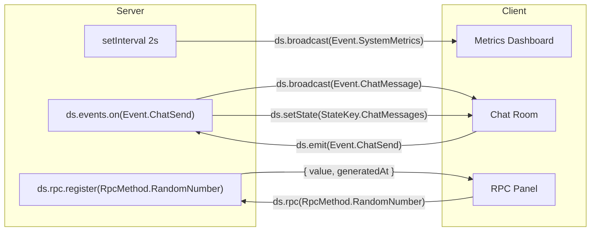
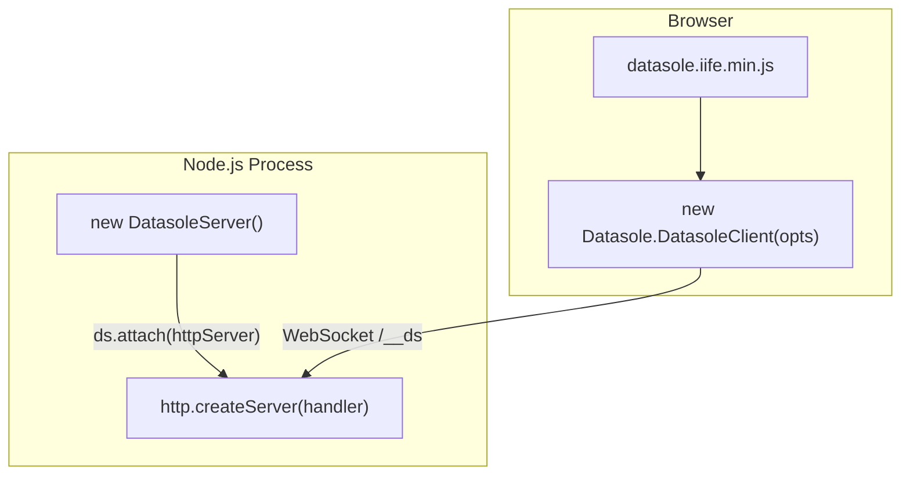
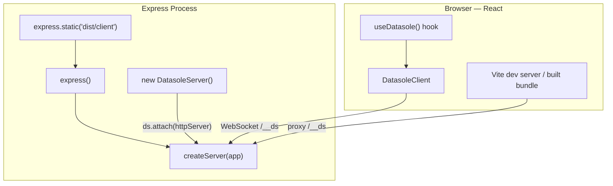
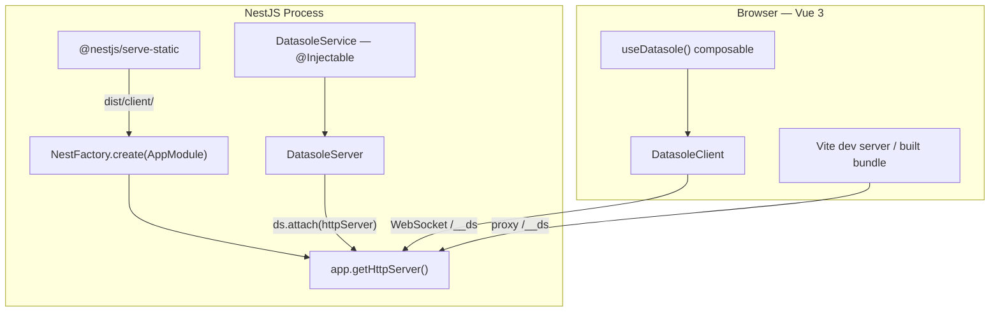

# Demos

Three independent demo applications ship with datasole, each implementing the **same realtime webapp** with a different framework stack. All demos are in the `demos/` directory and are tested by the automated e2e suite.

| Demo                              | Client                  | Server                      | Port |
| --------------------------------- | ----------------------- | --------------------------- | ---- |
| [Vanilla JS](#vanilla-js)         | Plain DOM + IIFE bundle | Node.js `http.createServer` | 4000 |
| [React + Express](#react-express) | React 19 + Vite         | Express 5                   | 4001 |
| [Vue 3 + NestJS](#vue-3-nestjs)   | Vue 3 SFC + Vite        | NestJS 11                   | 4002 |

## What Each Demo Shows

Every demo is a full-screen, dark-themed, responsive three-panel layout. All three share a single **`shared/contract.ts`** (`AppContract` + `RpcMethod` / `Event` / `StateKey` enums) — the same contract-first pattern as the [Developer Guide](developer-guide.md) and [Tutorials](tutorials.md).

1. **Server Metrics** — live-updating dashboard (uptime, connections, CPU, memory, message throughput), pushed from the server every 2 seconds via `ds.broadcast(Event.SystemMetrics, …)`.
2. **Global Chat Room** — client emits `Event.ChatSend`, server maintains a 50-message history under `StateKey.ChatMessages` and broadcasts `Event.ChatMessage` for instant delivery.
3. **RPC Random Number** — client calls `ds.rpc(RpcMethod.RandomNumber, { min, max })`, server returns a cryptographically random integer with timing metadata.



### Server-Side Logic (shared across all three)

All three demos implement identical business logic — the only difference is how it's wired into the framework:

```typescript
import { Event, RpcMethod, StateKey, type ChatMessage } from './shared/contract.js';

// Metrics broadcast every 2s
setInterval(() => {
  const snap = ds.metrics.snapshot();
  ds.broadcast(Event.SystemMetrics, {
    uptime: snap.uptime,
    connections: snap.connections,
    messagesIn: snap.messagesIn,
    messagesOut: snap.messagesOut,
    cpuUsage: Math.round(process.cpuUsage().user / 1000),
    memoryMB: Math.round(process.memoryUsage().heapUsed / 1024 / 1024),
    timestamp: Date.now(),
  });
}, 2000);

// Chat — receive, store, broadcast
ds.events.on(Event.ChatSend, ({ data }) => {
  const { text, username } = data;
  const msg: ChatMessage = { id: crypto.randomUUID(), text, username, ts: Date.now() };
  chatHistory.push(msg);
  if (chatHistory.length > 50) chatHistory.shift();
  void ds.setState(StateKey.ChatMessages, [...chatHistory]);
  ds.broadcast(Event.ChatMessage, msg);
});

// RPC — random number
ds.rpc.register(RpcMethod.RandomNumber, async ({ min, max }) => {
  return {
    value: crypto.randomInt(Math.floor(min), Math.floor(max) + 1),
    generatedAt: Date.now(),
  };
});
```

---

## Vanilla JS

**Zero frameworks, zero build step.** Pure browser JavaScript with the datasole IIFE bundle, served by a plain Node.js HTTP server.


### Quick Start

```bash
cd demos/vanilla
npm install
npm run dev       # node --watch server/index.mjs
```

Open [http://localhost:4000](http://localhost:4000).

### Integration Pattern



The server entrypoint is `server/index.mjs`. It creates a plain `http.Server`, serves static files from `client/`, and attaches `DatasoleServer` for WebSocket upgrades plus automatic runtime asset serving.

### Server Walkthrough

```javascript
// server/index.mjs — key parts
import { createServer } from 'http';
import { DatasoleServer } from 'datasole/server';

const ds = new DatasoleServer<AppContract>();

// Register chat handler, RPC, metrics broadcast (see shared logic above)

const httpServer = createServer(serveStatic);
ds.attach(httpServer);
httpServer.listen(4000);
```

### Client Walkthrough

The client loads the IIFE bundle via `<script>` tag, giving a `window.Datasole` global. No bundler needed.

```javascript
// client/app.mjs — key parts (imports RpcMethod, Event, StateKey from /shared/contract.mjs)
const ds = new Datasole.DatasoleClient({
  url: 'ws://' + location.host,
});
ds.connect();

ds.on(Event.SystemMetrics, function (ev) {
  // Update DOM with ev.data.uptime, ev.data.connections, etc.
});

ds.subscribeState(StateKey.ChatMessages, function (messages) {
  /* render history */
});
ds.on(Event.ChatMessage, function (ev) {
  /* append new message */
});
ds.emit(Event.ChatSend, { text, username });

const data = await ds.rpc(RpcMethod.RandomNumber, { min: 1, max: 100 });
```

DatasoleServer serves runtime files automatically:

- `/__ds/datasole.iife.min.js` — client bundle (loaded via `<script>` tag)
- `/__ds/datasole-worker.iife.min.js` — worker script (loaded automatically by `DatasoleClient`)

### Screenshots

| Initial load                                        | Chat                                        | RPC result                                |
| --------------------------------------------------- | ------------------------------------------- | ----------------------------------------- |
|  |  |  |

---

## React + Express

**React 19 with Vite for the frontend, Express 5 for the backend.** TypeScript throughout, with a custom `useDatasole` hook managing the client lifecycle.


### Quick Start

```bash
cd demos/react-express
npm install
npm run dev       # concurrently: Vite on :5173 + Express on :4001
```

Open [http://localhost:5173](http://localhost:5173). For production: `npm run build && npm start`, then open [http://localhost:4001](http://localhost:4001).

### Integration Pattern



In development, Vite proxies `/__ds` (WebSocket + runtime assets) to Express. In production, Express serves the Vite-built static files while DatasoleServer serves runtime assets under `/__ds`.

### Server Walkthrough

```typescript
// server/index.ts — key parts
import express from 'express';
import { createServer } from 'http';
import { DatasoleServer } from 'datasole/server';

const app = express();

// Serve Vite build in production
const clientDist = resolve(__dirname, '../dist/client');
if (existsSync(clientDist)) {
  app.use(express.static(clientDist));
  app.get('/{*splat}', (_req, res) => {
    res.sendFile(resolve(clientDist, 'index.html'));
  });
}

const httpServer = createServer(app);
const ds = new DatasoleServer<AppContract>();
// Default executor model is async; set executor options explicitly if needed.
ds.attach(httpServer);

// Register chat, RPC, metrics (see shared logic above)

httpServer.listen(4001);
```

### Vite Dev Proxy

```typescript
// vite.config.ts — proxy WebSocket + runtime assets to Express
proxy: {
  '/__ds': { target: 'http://localhost:4001', ws: true },
  '/__ds/datasole-worker.iife.min.js': { target: 'http://localhost:4001' },
}
```

### Client Walkthrough — Hooks

The hook layer replaces any need for Redux, Zustand, or other state stores. Wrap your app in `DatasoleProvider`, and all descendants get reactive access to server data via hooks:

```tsx
// App.tsx — one-time setup
import { DatasoleProvider } from './hooks/useDatasole';

export function App() {
  return (
    <DatasoleProvider>
      <Layout>
        <MetricsDashboard />
        <ChatRoom />
        <RpcDemo />
      </Layout>
    </DatasoleProvider>
  );
}
```

Child components consume server data with zero boilerplate:

```tsx
// MetricsDashboard.tsx — entire hook usage
import { useMemo } from 'react';
import { Event } from '../../shared/contract';
import { useDatasoleEvent } from '../hooks/useDatasole';

export function MetricsDashboard() {
  // One line — re-renders when the server broadcasts new data
  const metrics = useDatasoleEvent<Metrics>(Event.SystemMetrics);

  // Derived values with useMemo, no selectors or reducers
  const memoryPct = useMemo(
    () => (metrics ? Math.round((metrics.memoryMB / (metrics.totalMemoryGB * 1024)) * 100) : 0),
    [metrics?.memoryMB, metrics?.totalMemoryGB],
  );

  return (
    <p>
      {metrics?.memoryMB} MB ({memoryPct}%)
    </p>
  );
}
```

Three hook flavors cover every datasole pattern:

```tsx
import { Event, RpcMethod, StateKey } from '../shared/contract';

// Server broadcast events → React state
const metrics = useDatasoleEvent<Metrics>(Event.SystemMetrics);

// Server-managed state → React state (synced via JSON Patch)
const messages = useDatasoleState<ChatMessage[]>(StateKey.ChatMessages);

// Raw client for imperative calls (emit, rpc)
const ds = useDatasoleClient();
await ds?.rpc(RpcMethod.RandomNumber, { min: 1, max: 100 });

// Connection state
const conn = useConnectionState(); // 'connected' | 'disconnected' | ...
```

No prop drilling, no store modules, no actions/reducers. The server is the store.

### Screenshots

| Initial load                                              | Chat                                              | RPC result                                      |
| --------------------------------------------------------- | ------------------------------------------------- | ----------------------------------------------- |
|  |  |  |

---

## Vue 3 + NestJS

**Vue 3 Single File Components with Vite, NestJS 11 for the backend.** The datasole server logic lives in an `@Injectable()` service with NestJS lifecycle hooks.


### Quick Start

```bash
cd demos/vue-nestjs
npm install
npm run dev       # concurrently: Vite on :5174 + NestJS on :4002
```

Open [http://localhost:5174](http://localhost:5174). For production: `npm run build && npm start`, then open [http://localhost:4002](http://localhost:4002).

### Integration Pattern



### Server Walkthrough — NestJS Service

The `DatasoleService` wraps all datasole logic in an injectable service with proper lifecycle management:

```typescript
// server/src/datasole.service.ts — key parts
import { Injectable, OnModuleDestroy } from '@nestjs/common';
import { DatasoleServer } from 'datasole/server';
import { Event, RpcMethod, type AppContract } from '../../shared/contract.js';

@Injectable()
export class DatasoleService implements OnModuleDestroy {
  readonly ds = new DatasoleServer<AppContract>();
  private metricsInterval: ReturnType<typeof setInterval> | null = null;

  async init(): Promise<void> {
    // Register chat, RPC, metrics (see shared logic above)
    this.ds.events.on(Event.ChatSend, handler);
    this.ds.rpc.register(RpcMethod.RandomNumber, handler);
    this.metricsInterval = setInterval(broadcastMetrics, 2000);
  }

  onModuleDestroy(): void {
    if (this.metricsInterval) clearInterval(this.metricsInterval);
    this.ds.close();
  }
}
```

Bootstrap attaches to the raw Node HTTP server. No manual worker-file route is needed:

```typescript
// server/src/main.ts
import 'reflect-metadata'; // required before NestJS
import { NestFactory } from '@nestjs/core';
import { AppModule } from './app.module.js';
import { DatasoleService } from './datasole.service.js';

const app = await NestFactory.create(AppModule);

const datasoleService = app.get(DatasoleService);
await datasoleService.init();
datasoleService.ds.attach(app.getHttpServer());
await app.listen(4002);
```

### Client Walkthrough — Composables

The composable layer replaces any need for Vuex or Pinia. Call `useDatasole()` once at the app root, and all descendants get reactive access to server data via `inject()`:

```typescript
// App.vue — one-time setup
import { useDatasole } from './composables/useDatasole';
useDatasole(); // provides the client to the entire component tree
```

Child components consume server data with zero boilerplate:

```vue
<!-- MetricsDashboard.vue — entire script section -->
<script setup lang="ts">
import { computed } from 'vue';
import { Event } from '../../shared/contract';
import { useDatasoleEvent } from '../composables/useDatasole';

interface Metrics {
  uptime: number;
  connections: number;
  memoryMB: number;
  totalMemoryGB: number;
}

// One line — this ref auto-updates from the Web Worker
const metrics = useDatasoleEvent<Metrics>(Event.SystemMetrics);

// Computed properties compose naturally
const memoryPct = computed(() =>
  metrics.value
    ? Math.round((metrics.value.memoryMB / (metrics.value.totalMemoryGB * 1024)) * 100)
    : 0,
);
</script>

<template>
  <p v-if="metrics">Memory: {{ metrics.memoryMB }} MB ({{ memoryPct }}%)</p>
</template>
```

Three composable flavors cover every datasole pattern:

```typescript
import { Event, RpcMethod, StateKey } from '../shared/contract';

// Server broadcast events → reactive ref
const metrics = useDatasoleEvent<Metrics>(Event.SystemMetrics);

// Server-managed state → reactive ref (synced via JSON Patch)
const messages = useDatasoleState<ChatMessage[]>(StateKey.ChatMessages);

// Raw client for imperative calls (emit, rpc)
const ds = useDatasoleClient();
await ds.value?.rpc(RpcMethod.RandomNumber, { min: 1, max: 100 });

// Connection state
const conn = useConnectionState(); // 'connected' | 'disconnected' | ...
```

No props drilling, no store modules, no actions/mutations. The server is the store.

### Vite Dev Proxy

```typescript
// vite.config.ts — proxy WebSocket + runtime assets to NestJS
proxy: {
  '/__ds': { target: 'http://localhost:4002', ws: true },
  '/__ds/datasole-worker.iife.min.js': { target: 'http://localhost:4002' },
  '/datasole-worker.iife.min.js': { target: 'http://localhost:4002' },
}
```

### NestJS-Specific Notes

- `reflect-metadata` must be imported **before** any NestJS import — it's the first line of `main.ts`
- `tsconfig.server.json` enables `experimentalDecorators` and `emitDecoratorMetadata` (the base tsconfig doesn't include these)
- Production static serving uses `@nestjs/serve-static` with `ServeStaticModule.forRoot()`
- Datasole attaches directly to `app.getHttpServer()` — no NestJS WebSocket gateway is needed
- Vue demo uses `workerUrl: '/datasole-worker.iife.min.js'` to align with Nest static middleware precedence

### Screenshots

| Initial load                                           | Chat                                           | RPC result                                   |
| ------------------------------------------------------ | ---------------------------------------------- | -------------------------------------------- |
|  |  |  |

---

## Running the E2E Tests

The demo e2e tests are an **optional** test suite, separate from the core e2e tests:

```bash
npm run test:e2e:demos
```

This:

1. Installs each demo's dependencies (if `node_modules` is missing)
2. Builds each demo for production
3. Starts the production server
4. Runs Playwright tests: connection, live metrics (within 5s), chat send/receive, RPC call/response
5. Captures screenshots to `docs/public/screenshots/` and `.screenshots/`

The screenshots on this page are generated automatically by this test suite.
