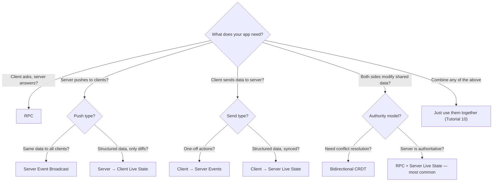

# Examples

Quick-reference examples organized by **what you want to build**. Each is self-contained — copy the server and client code, run, and it works.

For step-by-step learning, see the [Tutorials](tutorials.md).

---

## By Pattern

### RPC Only

The simplest request/response pattern. Client calls, server responds.

**Use cases:** form submissions, data lookups, actions with confirmation.

```typescript
// --- server.ts ---
import { createServer } from 'http';
import { DatasoleServer } from 'datasole/server';

const ds = new DatasoleServer();
const http = createServer();
ds.attach(http);

ds.rpc<{ email: string }, { valid: boolean }>('validateEmail', async ({ email }) => {
  return { valid: /^[^@]+@[^@]+\.[^@]+$/.test(email) };
});

ds.rpc<{ query: string }, { results: string[] }>('search', async ({ query }) => {
  // Imagine a database query here
  return { results: [`Result for "${query}"`] };
});

http.listen(3000);
```

```typescript
// --- client.ts ---
import { DatasoleClient } from 'datasole/client';

const ds = new DatasoleClient({ url: 'ws://localhost:3000' });
ds.connect();

const { valid } = await ds.rpc<{ valid: boolean }>('validateEmail', { email: 'a@b.com' });
const { results } = await ds.rpc<{ results: string[] }>('search', { query: 'datasole' });
```

---

### Server Event Broadcast

One-way push from server to all clients. Clients never request — they just listen.

**Use cases:** stock tickers, live scores, system alerts, notification feeds.

```typescript
// --- server.ts ---
import { createServer } from 'http';
import { DatasoleServer } from 'datasole/server';

const ds = new DatasoleServer();
const http = createServer();
ds.attach(http);
http.listen(3000);

// Push a heartbeat every second
setInterval(() => {
  ds.broadcast('heartbeat', {
    timestamp: Date.now(),
    connections: 42, // from your metrics
  });
}, 1000);

// Push on external trigger (e.g., webhook, database change)
function onPriceChange(symbol: string, price: number) {
  ds.broadcast('price:update', { symbol, price });
}
```

```typescript
// --- client.ts ---
import { DatasoleClient } from 'datasole/client';

const ds = new DatasoleClient({ url: 'ws://localhost:3000' });
ds.connect();

ds.on('heartbeat', (data) => console.log('Server heartbeat:', data));
ds.on('price:update', (data) => console.log(`${data.symbol}: $${data.price}`));
```

---

### Server → Client Live State (JSON Patch)

The **killer pattern**: server mutates a data model, clients see a live mirror that auto-updates. Only diffs are sent. Drop this into React/Vue and your template re-renders automatically.

**Use cases:** dashboards, admin panels, leaderboards, any "live page."

```typescript
// --- server.ts ---
import { createServer } from 'http';
import { DatasoleServer } from 'datasole/server';

const ds = new DatasoleServer();
const http = createServer();
ds.attach(http);
http.listen(3000);

// The model
interface Leaderboard {
  players: { name: string; score: number }[];
  lastUpdated: string;
}

const board: Leaderboard = { players: [], lastUpdated: '' };

// Mutate the model — datasole diffs and pushes patches
async function addScore(name: string, score: number) {
  const existing = board.players.find((p) => p.name === name);
  if (existing) {
    existing.score += score;
  } else {
    board.players.push({ name, score });
  }
  board.players.sort((a, b) => b.score - a.score);
  board.lastUpdated = new Date().toISOString();
  await ds.setState('leaderboard', board);
}
```

```tsx
// --- client (React) ---
import { DatasoleClient } from 'datasole/client';
import { useEffect, useRef, useState } from 'react';

function Leaderboard() {
  const ds = useRef(new DatasoleClient({ url: 'ws://localhost:3000' }));
  const [board, setBoard] = useState({ players: [], lastUpdated: '' });

  useEffect(() => {
    ds.current.connect();
    ds.current.subscribeState('leaderboard', setBoard);
    return () => {
      ds.current.disconnect();
    };
  }, []);

  return (
    <table>
      <tbody>
        {board.players.map((p, i) => (
          <tr key={p.name}>
            <td>{i + 1}</td>
            <td>{p.name}</td>
            <td>{p.score}</td>
          </tr>
        ))}
      </tbody>
    </table>
  );
}
```

```vue
<!-- client (Vue 3 SFC) -->
<script setup lang="ts">
import { DatasoleClient } from 'datasole/client';
import { onMounted, onUnmounted, ref } from 'vue';

const client = new DatasoleClient({ url: 'ws://localhost:3000' });
const board = ref({ players: [], lastUpdated: '' });

onMounted(() => {
  client.connect();
  client.subscribeState('leaderboard', (s) => {
    board.value = s;
  });
});
onUnmounted(() => client.disconnect());
</script>

<template>
  <table>
    <tr v-for="(p, i) in board.players" :key="p.name">
      <td>{{ i + 1 }}</td>
      <td>{{ p.name }}</td>
      <td>{{ p.score }}</td>
    </tr>
  </table>
</template>
```

---

### Bidirectional CRDT

Both client and server can modify the same data. Conflicts are resolved automatically by the CRDT merge function. No server arbitration needed.

**Use cases:** collaborative editing, presence indicators, shared counters, voting.

```typescript
// --- server.ts ---
import { createServer } from 'http';
import { DatasoleServer } from 'datasole/server';
import { LWWMap } from 'datasole';

const ds = new DatasoleServer();
const http = createServer();
ds.attach(http);
http.listen(3000);

// Shared document: each field is a LWW register
const doc = new LWWMap<string>('server');

ds.on('doc:op', (op) => {
  doc.apply(op);
  ds.broadcast('doc:state', doc.state());
});

// Periodically broadcast for new joiners
setInterval(() => ds.broadcast('doc:state', doc.state()), 5000);
```

```typescript
// --- client.ts ---
import { DatasoleClient, CrdtStore } from 'datasole/client';

const ds = new DatasoleClient({ url: 'ws://localhost:3000' });
const store = new CrdtStore('client-' + crypto.randomUUID());
const doc = store.register<string>('doc', 'lww-map');

ds.connect();
ds.on('doc:state', (state) => store.mergeRemoteState('doc', state));

// Local edit → immediate local update + async server sync
function setField(key: string, value: string) {
  const op = doc.set(key, value);
  ds.emit('doc:op', op);
}
```

---

### Client → Server RPC + Server → Client Live State (The Common Pattern)

This is the pattern for **most real-world apps**: the client sends actions via RPC, the server processes them and updates its model, and all clients see the live result.

**Use cases:** todo apps, project management, inventory, any CRUD with live updates.

```typescript
// --- server.ts ---
import { createServer } from 'http';
import { DatasoleServer } from 'datasole/server';

const ds = new DatasoleServer();
const http = createServer();
ds.attach(http);
http.listen(3000);

interface Todo {
  id: string;
  text: string;
  done: boolean;
}
const todos: Todo[] = [];

async function syncTodos() {
  await ds.setState('todos', todos);
}

ds.rpc<{ text: string }, { id: string }>('addTodo', async ({ text }) => {
  const id = `t-${Date.now()}`;
  todos.push({ id, text, done: false });
  await syncTodos();
  return { id };
});

ds.rpc<{ id: string }, { ok: boolean }>('toggleTodo', async ({ id }) => {
  const todo = todos.find((t) => t.id === id);
  if (todo) todo.done = !todo.done;
  await syncTodos();
  return { ok: !!todo };
});

ds.rpc<{ id: string }, { ok: boolean }>('deleteTodo', async ({ id }) => {
  const idx = todos.findIndex((t) => t.id === id);
  if (idx >= 0) todos.splice(idx, 1);
  await syncTodos();
  return { ok: idx >= 0 };
});
```

```tsx
// --- client (React) ---
import { DatasoleClient } from 'datasole/client';
import { useEffect, useRef, useState } from 'react';

interface Todo {
  id: string;
  text: string;
  done: boolean;
}

function TodoApp() {
  const ds = useRef(new DatasoleClient({ url: 'ws://localhost:3000' }));
  const [todos, setTodos] = useState<Todo[]>([]);
  const [input, setInput] = useState('');

  useEffect(() => {
    ds.current.connect();
    ds.current.subscribeState<Todo[]>('todos', setTodos);
    return () => {
      ds.current.disconnect();
    };
  }, []);

  return (
    <div>
      <input value={input} onChange={(e) => setInput(e.target.value)} />
      <button
        onClick={async () => {
          await ds.current.rpc('addTodo', { text: input });
          setInput('');
        }}
      >
        Add
      </button>

      <ul>
        {todos.map((t) => (
          <li key={t.id}>
            <input
              type="checkbox"
              checked={t.done}
              onChange={() => ds.current.rpc('toggleTodo', { id: t.id })}
            />
            <span style={{ textDecoration: t.done ? 'line-through' : 'none' }}>{t.text}</span>
            <button onClick={() => ds.current.rpc('deleteTodo', { id: t.id })}>×</button>
          </li>
        ))}
      </ul>
    </div>
  );
}
```

Note: the client has **zero local state management for todos**. It calls RPCs and subscribes to the live model. The server is the single source of truth. Your React template "just works."

---

## By Framework

### Vanilla JS (Script Tag)

```html
<script src="https://unpkg.com/datasole/dist/client/datasole.iife.min.js"></script>
<script>
  const ds = new Datasole.DatasoleClient({ url: 'wss://your-server.com' });
  ds.connect();
  ds.subscribeState('myKey', (state) => {
    document.getElementById('output').textContent = JSON.stringify(state);
  });
</script>
```

### React

See every example above — all client code uses React hooks.

### Vue 3 (SFC)

See the Dashboard and Leaderboard examples above for `<script setup>` patterns.

### React Native

```typescript
import { DatasoleClient } from 'datasole/client';

// No Web Workers in React Native — use fallback transport
const ds = new DatasoleClient({
  url: 'wss://your-server.com',
  useWorker: false,
});
ds.connect();
```

### Express

```typescript
import express from 'express';
import { createServer } from 'http';
import { DatasoleServer } from 'datasole/server';

const app = express();
const http = createServer(app);
new DatasoleServer().attach(http);
http.listen(3000);
```

### NestJS

```typescript
import { DatasoleServer, DatasoleNestAdapter } from 'datasole/server';

const ds = new DatasoleServer();
app.useWebSocketAdapter(new DatasoleNestAdapter(ds));
```

### Native HTTP (no framework)

```typescript
import { createServer } from 'http';
import { DatasoleServer } from 'datasole/server';

const http = createServer();
new DatasoleServer().attach(http);
http.listen(3000);
```

---

## Pattern Decision Tree


